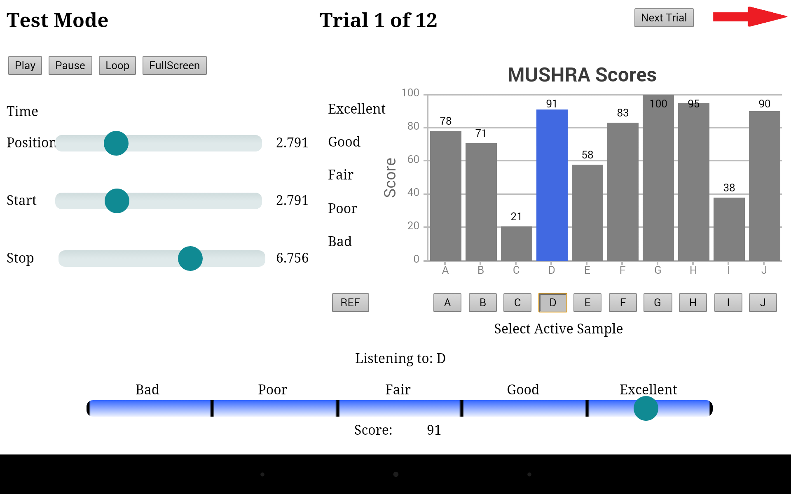

# TCD-MUSHRA

The TCD-MUSHRA Web UI was created to perform MUSHRA (MUlti Stimulus test with Hidden Reference and Anchor, see [ITU Recommendation ITU-R BS.1534-1](www.itu.int/rec/R-REC-BS.1534)) tests on a Nexus 7 tablet. Several MUSHRA experiments were run using the application in Spring/Summer 2014. The application is written in HTML5 and Javascript, with PHP scripts used to load test information and save user scores.

The application makes use of a few third-party projects:

- Sliders from GitHub user:nelsonic ([link to project](https://github.com/nelsonic/range-touch))
- Chart from [canvasjs.com](canvasjs.com)
- Function to change colour of slider while sliding, based on an answer posted by user:fedeetz at StackOverflow ([link to answer](http://stackoverflow.com/questions/18389224/how-to-style-html5-range-input-to-have-different-color-before-and-after-slider/18389801#18389801))

The application was hosted locally on the Nexus 7 using a local server app called [BitWebServer](https://play.google.com/store/apps/details?id=com.andi.serverweb&hl=en), which can be purchased on the Google Play Store. The purpose of hosting the app locally was to reduce the delay in loading new audio, since mobile devices usually disable preloading of audio. This limitation (along with others) of HTML5 audio on mobile devices also led to the use of audio sprites (see [this blogpost](http://pupunzi.open-lab.com/2013/03/13/making-html5-audio-actually-work-on-mobile/) for an explanation of audio sprites), meaning that all audio samples for a particular trial are on one audio track, with gaps of silence used to separate the samples.

Matlab scripts are provided with this download to create new audio sprites. In the case of the Matlab scripts and the application itself, the "readme" file in each directory should be consulted for further information. 
